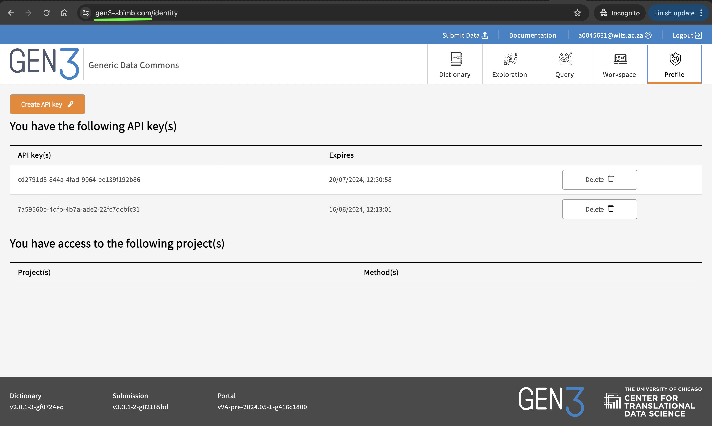

### Custom Domain Name for Gen3 Instance
Suppose we purchase a domain name `gen3-sbimb.com` from [GoDaddy](https://www.godaddy.com/en-ph). Then we can use a service like [ZeroSSL](https://zerossl.com/) to get trusted certificates. If we use the free option, then the certificates will need to be renewed every 90 days.   

The certificates can be downloaded as a `.zip` file. After extraction, there'll be three files, namely:
- ca_bundle.crt
- certificate.crt
- private.key

On the Ubuntu machine where the Kubernetes cluster is running, these certificates should be copied to the appropriate directories, respectively.   
```bash
sudo cp certificate.crt /etc/ssl/
sudo cp ca_bundle.crt /etc/ssl/
sudo cp private.key /etc/ssl/private
```
A TLS Kubernetes secret should also be generated with:
```bash
kubectl create secret tls gen3-sbimb-secret --cert=certificate.crt --key=private.key
```
The ingress resource should be modified to include this new host name and the secret referencing the certificates, i.e.
```yaml
apiVersion: networking.k8s.io/v1
kind: Ingress
metadata:
  name: revproxy-dev
  namespace: default
spec:
  ingressClassName: nginx
  rules:
  - host: cloud08.core.wits.ac.za
    http:
      paths:
      - backend:
          service:
            name: revproxy-service
            port:
              number: 80
        path: /
        pathType: Prefix
  - host: www.gen3-sbimb.com
    http:
      paths:
      - backend:
          service:
            name: revproxy-service
            port:
              number: 80
        path: /
        pathType: Prefix
  - host: gen3-sbimb.com
    http:
      paths:
      - backend:
          service:
            name: revproxy-service
            port:
              number: 80
        path: /
        pathType: Prefix
  tls:
  - hosts:
    - cloud08.core.wits.ac.za
    secretName: cloud08-tls-secret
  - hosts:
    - gen3-sbimb.com
    secretName: gen3-sbimb-secret
  - hosts:
    - www.gen3-sbimb.com
    secretName: gen3-sbimb-secret
```
In the Google Developer Console, the login and redirecturi parameters need to be updated with the new base URL. The `fence-config.yaml` also needs to have the base URL updated.   

    
