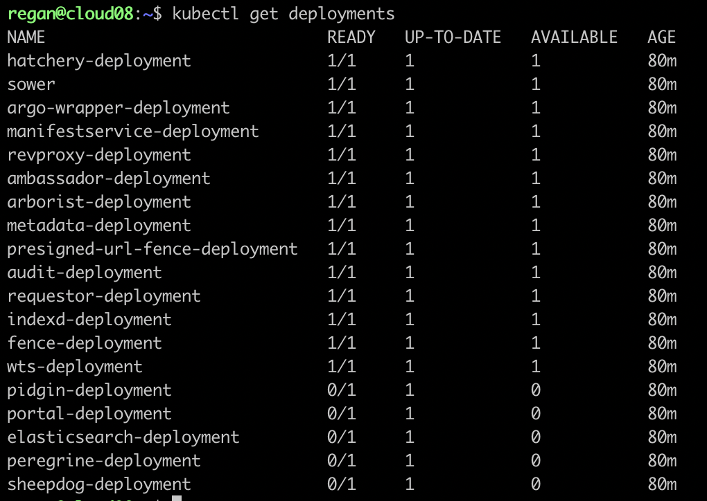

## Troubleshooting Networking Issues
Some of the Gen3 deployments are not in a READY state.   

     

Looking at the logs of the `peregrine-deployment` pod,
```bash
kubectl logs pod/peregrine-deployment-694c89d4b4-x46qm
```
we see the following information (this is just an excerpt):
```bash
Traceback (most recent call last):
  File "/usr/local/lib/python3.6/site-packages/urllib3/connectionpool.py", line 710, in urlopen
    chunked=chunked,
  File "/usr/local/lib/python3.6/site-packages/urllib3/connectionpool.py", line 386, in _make_request
    self._validate_conn(conn)
  File "/usr/local/lib/python3.6/site-packages/urllib3/connectionpool.py", line 1040, in _validate_conn
    conn.connect()
  File "/usr/local/lib/python3.6/site-packages/urllib3/connection.py", line 426, in connect
    tls_in_tls=tls_in_tls,
  File "/usr/local/lib/python3.6/site-packages/urllib3/util/ssl_.py", line 450, in ssl_wrap_socket
    sock, context, tls_in_tls, server_hostname=server_hostname
  File "/usr/local/lib/python3.6/site-packages/urllib3/util/ssl_.py", line 493, in _ssl_wrap_socket_impl
    return ssl_context.wrap_socket(sock, server_hostname=server_hostname)
  File "/usr/local/lib/python3.6/ssl.py", line 407, in wrap_socket
    _context=self, _session=session)
  File "/usr/local/lib/python3.6/ssl.py", line 817, in __init__
    self.do_handshake()
  File "/usr/local/lib/python3.6/ssl.py", line 1077, in do_handshake
    self._sslobj.do_handshake()
  File "/usr/local/lib/python3.6/ssl.py", line 689, in do_handshake
    self._sslobj.do_handshake()
ssl.SSLError: [SSL: SSLV3_ALERT_HANDSHAKE_FAILURE] sslv3 alert handshake failure (_ssl.c:852)
```
There is an SSL or TLS issue with some of the deployments. We can try creating new certificates for the host (`cloud08`) using `openssl`:
```bash
mkdir -p cloud08_certs

openssl req \
-new \
-newkey rsa:2048 \
-x509 \
-sha256 \
-days 365 \
-nodes \
-subj "/O=cloud08/CN=cloud08.core.wits.ac.za" \
-keyout cloud08_certs/cloud08.key \
-out cloud08_certs/cloud08.crt
```
These certificates can be added to a Kubernetes secret as follows:
```bash
kubectl create secret tls cloud08-tls-secret --key cloud08_certs/cloud08.key --cert cloud08_certs/cloud08.crt
```
To create a self-signed certificate with SubjectAltName (SAN), we can do the following:
```bash
openssl genrsa -out cloud05.core.wits.ac.za.key 2048
openssl req -new -key cloud05.core.wits.ac.za.key -out cloud05.core.wits.ac.za.csr
```
There will be some prompts. They should be filled in accordingly. Then the following file should be created with
```bash
touch v3.ext
```
and populated with the following content:
```bash
subjectKeyIdentifier   = hash
authorityKeyIdentifier = keyid:always,issuer:always
basicConstraints       = CA:FALSE
keyUsage               = digitalSignature, nonRepudiation, keyEncipherment, dataEncipherment, keyAgreement, keyCertSign
subjectAltName         = DNS:cloud05.core.wits.ac.za, DNS:*.cloud05.core.wits.ac.za
issuerAltName          = issuer:copy
```
The self-signed certificate can then be generated with the following command:
```bash
openssl x509 -req -in cloud05.core.wits.ac.za.csr -signkey cloud05.core.wits.ac.za.key -out cloud05.core.wits.ac.za.crt -days 3650 -sha256 -extfile v3.ext
```
If successful, something similar to the following should be the output:
```bash
Certificate request self-signature ok
subject=C = ZA, ST = Gauteng, L = Johannesburg, O = SBIMB, OU = Bioinformatics, CN = cloud08.core.wits.ac.za, emailAddress = a0045661@wits.ac.za
```
Now a Kubernetes secret can be created with:
```bash
kubectl create secret tls cloud08-tls-secret --key cloud08.core.wits.ac.za.key --cert cloud08.core.wits.ac.za.crt
```
We can also create a secret that uses the pre-existing certificates on the node which reside in the `/etc/ssl/certs/` directory:
```bash
kubectl create secret tls cloud08-certs --key /etc/ssl/certs/ca-certificates.key --cert /etc/ssl/certs/ca-certificates.crt
```
Unfortunately, there doesn't seem to be a `.key` file for these old certificates. Without the `.key` file, we cannot use the certificate.   

We can also try creating new certificates for node `pc78`, since there appears to be some mix up regarding the DNS involving the ip addresses of the `cloud08` node and the `pc78` node. Perhaps they are the same nodes with two different names.    
   

We'll do the following:
```bash
mkdir -p pc78_certs

openssl req \
-new \
-newkey rsa:2048 \
-x509 \
-sha256 \
-days 365 \
-nodes \
-subj "/O=pc78/CN=pc78.core.wits.ac.za" \
-keyout pc78_certs/pc78.key \
-out pc78_certs/pc78.crt
```
We'll then create the corresponding secret which will have these newly created certificates:
```bash
kubectl create secret tls pc78-tls-secret --key pc78_certs/pc78.key --cert pc78_certs/pc78.crt
```
The NGINX ingress controller should be edited to include this secret by adding the following to the `revproxy-dev` manifest under the `spec` section:
```bash
  tls:
  - hosts:
    - cloud08.core.wits.ac.za
    secretName: gen3-certs
  - hosts:
    - cloud08.core.wits.ac.za
    secretName: cloud08-tls-secret
  - hosts:
    - pc78.core.wits.ac.za
    secretName: gen3-certs
  - hosts:
    - pc78.core.wits.ac.za
    secretName: pc78-tls-secret
```

Another reason for the problems we are facing could be due to not having an external load balancer configured for the K3s cluster. When using a cloud provider like AWS, the Amazon Load Balancer (ALB) is automatically configured to be used by the cluster. For on-prem solutions, an external load balancer needs to be manually configured.    

After running the following command,
```bash
sudo iptables -S
```
the following information was found:
```bash
-A KUBE-SERVICES -d 10.43.248.157/32 -p tcp -m comment --comment "default/peregrine-service:http has no endpoints" -m tcp --dport 80 -j REJECT --reject-with icmp-port-unreachable
-A KUBE-SERVICES -d 10.43.45.52/32 -p tcp -m comment --comment "default/pidgin-service:https has no endpoints" -m tcp --dport 443 -j REJECT --reject-with icmp-port-unreachable
-A KUBE-SERVICES -d 10.43.45.52/32 -p tcp -m comment --comment "default/pidgin-service:http has no endpoints" -m tcp --dport 80 -j REJECT --reject-with icmp-port-unreachable
-A KUBE-SERVICES -d 10.43.214.116/32 -p tcp -m comment --comment "default/workspace-token-service:http has no endpoints" -m tcp --dport 80 -j REJECT --reject-with icmp-port-unreachable
-A KUBE-SERVICES -d 10.43.252.154/32 -p tcp -m comment --comment "default/portal-service:http has no endpoints" -m tcp --dport 80 -j REJECT --reject-with icmp-port-unreachable
-A KUBE-SERVICES -d 10.43.168.94/32 -p tcp -m comment --comment "default/sheepdog-service:http has no endpoints" -m tcp --dport 80 -j REJECT --reject-with icmp-port-unreachable
-A KUBE-SERVICES -d 10.43.214.116/32 -p tcp -m comment --comment "default/workspace-token-service:https has no endpoints" -m tcp --dport 443 -j REJECT --reject-with icmp-port-unreachable
-A KUBE-SERVICES -d 10.43.120.234/32 -p tcp -m comment --comment "default/gen3-dev-manifestservice:http has no endpoints" -m tcp --dport 80 -j REJECT --reject-with icmp-port-unreachable
-A KUBE-SERVICES -d 10.43.145.199/32 -p tcp -m comment --comment "default/elasticsearch has no endpoints" -m tcp --dport 9200 -j REJECT --reject-with icmp-port-unreachable
```

When running
```bash
kubectl get endpoints
```
the following output is received:   
| NAME                       | ENDPOINTS                       | AGE |
| -------------------------- | ------------------------------- | --- |
kubernetes                   | 146.141.240.78:6443             | 17d |
gen3-dev-manifestservice     | <none>                          | 58m |
peregrine-service            |                                 | 58m |
sheepdog-service             |                                 | 58m |
elasticsearch                |                                 | 58m |
gen3-dev-postgresql-hl       | 10.42.0.227:5432                | 58m |
hatchery-service             | 10.42.0.218:8000                | 58m |
sower-service                | 10.42.0.224:8000                | 58m |
gen3-dev-postgresql          | 10.42.0.227:5432                | 58m |
pidgin-service               |                                 | 58m |
argo-wrapper-service         | 10.42.0.240:8000                | 58m |
portal-service               |                                 | 58m |
revproxy-service             | 10.42.0.242:80                  | 58m |
ambassador-service           | 10.42.0.247:8080                | 58m |
ambassador-admin             | 10.42.0.247:8877                | 58m |
arborist-service             | 10.42.0.243:80                  | 58m |
metadata-service             | 10.42.0.226:80                  | 58m |
presigned-url-fence-service  | 10.42.0.235:80                  | 58m |
audit-service                | 10.42.0.220:80                  | 58m |
requestor-service            | 10.42.0.245:80                  | 58m |
indexd-service               | 10.42.0.222:80                  | 58m |
fence-service                | 10.42.0.225:80                  | 58m |
workspace-token-service      | 10.42.0.238:443,10.42.0.238:80  | 58m |

Perhaps the solution entails explicitly allowing traffic to those IP addresses listed above with the `--reject-with icmp-port-unreachable` flag, or maybe the ingress controller and/or network policy needs to be configured differently. There’s a `KUBE-SERVICES` chain in the target that’s created by `kube-proxy`. We can list the rules in that chain as follows:
```bash
sudo iptables -t nat -L KUBE-SERVICES -n  | column -t
```   
A long list of services will be displayed, however, the `peregrine`, `pidgin`, `elasticsearch`, `sheepdog`, and the `portal` services are not listed. It could be that somehow the Firewall or the `kube-proxy` is blocking traffic to those services.   

Adding the following rules to the `iptables` script might help:
```bash
#K3s Cluster
$ipt -A INPUT -d 10.42.0.9 -j ACCEPT
$ipt -A OUTPUT -d 10.42.0.9 -j ACCEPT
$ipt -A INPUT -d 10.43.0.0/16 -j ACCEPT
$ipt -A OUTPUT -d 10.43.0.0/16 -j ACCEPT
$ipt -A INPUT -d 10.42.0.0/16 -j ACCEPT
$ipt -A OUTPUT -d 10.42.0.0/16 -j ACCEPT
$ipt -A INPUT -i eth0 -p tcp --dport 6443 -m state --state NEW,ESTABLISHED -j ACCEPT
$ipt -A INPUT -i eth0 -p tcp --dport 10250 -m state --state NEW,ESTABLISHED -j ACCEPT
$ipt -A INPUT -i eth0 -p tcp -m tcp --dport 0:65535 -j ACCEPT
$ipt -A INPUT -i eth0 -p tcp -m tcp --dport 2379:2380 -j ACCEPT
$ipt -A INPUT -p udp --dport 8472 -m multiport --sports 0:65535 -j ACCEPT
$ipt -A INPUT -p udp --dport 51820 -m multiport --sports 0:65535 -j ACCEPT
$ipt -A INPUT -p udp --dport 51821 -m multiport --sports 0:65535 -j ACCEPT
$ipt -A INPUT -i eth0 -p tcp --dport 80 -m comment --comment "# http #" -j ACCEPT
$ipt -A INPUT -i eth0 -p tcp --dport 443 -m comment --comment "# https #" -j ACCEPT
```
To temporarily disable the Firewall, run the following:
```bash
sudo iptables -P INPUT ACCEPT
sudo iptables -P FORWARD ACCEPT
sudo iptables -P OUTPUT ACCEPT
sudo iptables -t nat -F
sudo iptables -t mangle -F
sudo iptables -F
sudo iptables -X
```

The `peregrine` deployment pod refuses to reach a READY state due to some SSL error of the form
```bash
ssl.SSLError: [SSL: SSLV3_ALERT_HANDSHAKE_FAILURE] sslv3 alert handshake failure (_ssl.c:852)
```
When running the cURL command,
```bash
curl https://s3.amazonaws.com/dictionary-artifacts/datadictionary/develop/schema.json
```
from inside the VM, a full JSON response is received. However, when running that same cURL command from inside the pod (with the `--image=nicolaka/netshoot` container running for debugging purposes), we get an ssl connection refused error (see image).   
   

The command for debugging the container is
```bash
kubectl debug <podname> -it --image=nicolaka/netshoot
```
and the command for entering into a running container is
```bash
kubectl exec --stdin --tty <podname> -- bash
```
For example, to attach a debugging sidecar container to the `coredns` pod, the following command can be run:
```bash
kubectl debug coredns-6799fbcd5-nw5fw -n kube-system -it --image=busybox:1.28 --target=coredns
```
The contents of the `resolv.conf` can be seen with:
```bash
cat etc/resolv.conf
```

There is reason to believe that certain certificates which are on the host machine are not present or accessible in the containers.   

We could also create a `netshoot-pod` in the `default` namespace by using the following manifest:   
**netshoot-pod.yaml**
```yaml
apiVersion: v1
kind: Pod
metadata:
  name: netshoot-pod
  namespace: default
spec:
  containers:
  - name: netshoot
    image: nicolaka/netshoot
    command: ["/bin/bash", "-c", "--"]
    args: ["while true; do sleep 30; done;"]
```
The pod can be created with:
```bash
kubectl apply -f netshoot-pod.yaml
```
and a shell to the `netshoot-pod` container can be opened with:
```bash
kubectl exec -it netshoot-pod -- /bin/bash
```
While inside the container, we can hit external endpoints like:
```bash
curl https://example.com -I
```
The goal of performing such exercises is to see if containers inside the cluster can make network requests to services outside of the cluster. The following two screenshots clearly indicate that there is a problem when trying to reach external services from within the cluster.   

    

   

These requests fail. However, when setting `hostNetwork: true` in the `.spec` of the pod definition, then there is a successful response.   

    

Setting `hostNetwork: true` in the `.spec` of the pod templates of the Gen3 deployments does not work as desired. Errors of the type 
```bash
0/1 nodes are available: 1 node(s) didn't have free ports for the requested pod ports. preemption: 0/1 nodes are available: 1 No preemption victims found for incoming pod
``` 
are encountered. This is because only _one_ pod can use the host's network, since the host node only has one ip address. This is clearly **not** the solution.   

While inside the `netshoot` pod, we can run 
```bash
cat /etc/resolv.conf
```
to see which nameserver address the pod is using. We get an output of the form,
```bash
search default.svc.cluster.local svc.cluster.local cluster.local DOMAINS
nameserver 10.43.0.10
options ndots:5
```   
which has the same ip address as the `service/kube-dns` in the `kube-system` namespace.   

When running
```bash
cat /etc/resolv.conf
```
on the node, we get the following response:
```bash
# Dynamic resolv.conf(5) file for glibc resolver(3) generated by resolvconf(8)
#     DO NOT EDIT THIS FILE BY HAND -- YOUR CHANGES WILL BE OVERWRITTEN
# 127.0.0.53 is the systemd-resolved stub resolver.
# run "systemd-resolve --status" to see details about the actual nameservers.

nameserver 146.141.8.16
nameserver 146.141.15.210
nameserver 8.8.8.8
nameserver 8.8.4.4
nameserver 127.0.0.53
```

When running
```bash
cat /etc/resolv.conf
```
inside the `netshoot-pod` container, we get the following response:
```bash
search default.svc.cluster.local svc.cluster.local cluster.local DOMAINS
nameserver 10.43.0.10
options ndots:5
```

**NGINX Load Balancer**
Create an NGINX load balancer that runs inside a Docker container:
```bash
sudo docker run -d --restart unless-stopped \
    -v ${PWD}/nginx.conf:/etc/nginx/nginx.conf \
    -p 6443:6443 \
    nginx:stable
```

**DNS Settings**
The command `cat /run/systemd/resolve/resolv.conf` displays the following: 
```bash
# This is /run/systemd/resolve/resolv.conf managed by man:systemd-resolved(8).
# Do not edit.
#
# This file might be symlinked as /etc/resolv.conf. If you're looking at
# /etc/resolv.conf and seeing this text, you have followed the symlink.
#
# This is a dynamic resolv.conf file for connecting local clients directly to
# all known uplink DNS servers. This file lists all configured search domains.
#
# Third party programs should typically not access this file directly, but only
# through the symlink at /etc/resolv.conf. To manage man:resolv.conf(5) in a
# different way, replace this symlink by a static file or a different symlink.
#
# See man:systemd-resolved.service(8) for details about the supported modes of
# operation for /etc/resolv.conf.

nameserver 146.141.8.16
nameserver 146.141.15.210
nameserver 8.8.8.8
# Too many DNS servers configured, the following entries may be ignored.
nameserver 8.8.4.4
search DOMAINS
```
The stubbed form of the `resolv.conf` file has the following contents, which can be seen after running `cat /run/systemd/resolve/stub-resolv.conf`:
```bash
# This is /run/systemd/resolve/stub-resolv.conf managed by man:systemd-resolved(8).
# Do not edit.
#
# This file might be symlinked as /etc/resolv.conf. If you're looking at
# /etc/resolv.conf and seeing this text, you have followed the symlink.
#
# This is a dynamic resolv.conf file for connecting local clients to the
# internal DNS stub resolver of systemd-resolved. This file lists all
# configured search domains.
#
# Run "resolvectl status" to see details about the uplink DNS servers
# currently in use.
#
# Third party programs should typically not access this file directly, but only
# through the symlink at /etc/resolv.conf. To manage man:resolv.conf(5) in a
# different way, replace this symlink by a static file or a different symlink.
#
# See man:systemd-resolved.service(8) for details about the supported modes of
# operation for /etc/resolv.conf.

nameserver 127.0.0.53
options edns0 trust-ad
search DOMAINS
```
The `/etc/resolv.conf` file contains the following:
```bash
# Dynamic resolv.conf(5) file for glibc resolver(3) generated by resolvconf(8)
#     DO NOT EDIT THIS FILE BY HAND -- YOUR CHANGES WILL BE OVERWRITTEN
# 127.0.0.53 is the systemd-resolved stub resolver.
# run "systemd-resolve --status" to see details about the actual nameservers.

nameserver 146.141.8.16
nameserver 146.141.15.210
nameserver 8.8.8.8
nameserver 8.8.4.4
nameserver 127.0.0.53
```
The `/etc/resolv.conf` file is symlinked to the `/run/systemd/resolve/stub-resolv.conf` file.   

The command `nslookup 146.141.8.16` gives the following result:
```bash
16.8.141.146.in-addr.arpa	name = thebe.ds.wits.ac.za.
```
The command `nslookup 146.141.15.210` gives the following result:
```bash
210.15.141.146.in-addr.arpa	name = mail1.wits.ac.za.
```
We need to modify the `resolv.conf` file by removing the top two nameserver ip addresses, since they are not allowing us to access the public internet. We should use `1.1.1.1` and `8.8.8.8`, which are the primary DNS servers for Cloudflare and Google DNS, respectively.    

To change the DNS server, we need to configure the `/etc/network/interfaces` file. The command `cat /etc/network/interfaces` displays the following:
```bash
# This file describes the network interfaces available on your system
# and how to activate them. For more information, see interfaces(5).

source /etc/network/interfaces.d/*

# The loopback network interface
auto lo
iface lo inet loopback

# The primary network interface
auto eno0
iface eno0 inet manual


auto br0
iface br0 inet static
      address 146.141.240.78
      netmask 255.255.255.0
      network 146.141.240.0
      broadcast 146.141.240.255
      gateway 146.141.240.10
      bridge_ports eno0
      bridge_stp off
      bridge_fd 0
      bridge_maxwait 0
      dns-nameservers 146.141.8.16 146.141.15.210 8.8.8.8
```
We should ensure that the `resolvconf` service is enabled and running with:
```bash
sudo systemctl status resolvconf.service
```
If there is no response, then the service can be started and enabled with
```bash
sudo systemctl start resolvconf.service
sudo systemctl enable resolvconf.service
```
Now the `/etc/resolvconf/resolv.conf.d/head` file can be edited with
```bash
sudo vim /etc/resolvconf/resolv.conf.d/head
```
Let us modify the `/etc/resolvconf/resolv.conf.d/head` file as follows:
```bash
nameserver 146.141.8.16
nameserver 146.141.15.210
nameserver 8.8.8.8
search core.wits.ac.za
```
The updated scripts can be forced to run with
```bash
sudo resolvconf --enable-updates
sudo resolvconf -u
```
This should change the DNS settings of the host machine. The following commands can also be run if necessary:
```bash
sudo systemctl restart resolvconf.service
sudo systemctl restart systemd-resolved.service
```

Running the command `ip r` returns the routes, which are
```bash
default via 146.141.240.10 dev br0 onlink
10.42.0.0/24 dev cni0 proto kernel scope link src 10.42.0.1
146.141.240.0/24 dev br0 proto kernel scope link src 146.141.240.78
172.17.0.0/16 dev docker0 proto kernel scope link src 172.17.0.1 linkdown
192.168.123.0/24 dev virbr0 proto kernel scope link src 192.168.123.1 linkdown
```

If problems persist, perhaps the solution lies in running:
```bash
sudo dpkg-reconfigure resolvconf
```
and then rebooting the system with `sudo reboot`.   

A custom `resolv.conf` file named `/etc/k3s-resolv.conf` needs to be created that will contain the upstream DNS server for any external domains. The contents of this file should be identical to that of the host's `/etc/resolv.conf` file, with the addition of the router's IP address, which is usually `192.168.1.1`. So in our case, it would look like this:
```bash
nameserver 192.168.1.1
nameserver 146.141.8.16
nameserver 146.141.15.210
nameserver 8.8.8.8
search core.wits.ac.za
```
We need to update the `/etc/rancher/k3s/config.yaml` file by appending the kubelet arg, i.e. 
```bash
echo 'kubelet-arg:' | sudo tee -a /etc/rancher/k3s/config.yaml
echo '- "resolv-conf=/etc/k3s-resolv.conf"' | sudo tee -a /etc/rancher/k3s/config.yaml
```
This is done so that K3s will automatically read the config at startup. A K3s stop-and-start will be needed for the changes to be reflected, so the following commands should be run:
```bash
sudo systemctl stop k3s
sleep 10
sudo systemctl start k3s
systemctl status k3s
```
The `coredns` pod in the `kube-system` namespace should be deleted (it will be recreated immediately and should read the updated configuration).

**Disabling IPv6 via sysctl settings**
If either of the following commands return a result,
```bash
ip -6 addr
```
or
```bash
ip a | grep inet6 
```
then IPv6 is enabled on your system. To temporarily disable IPv6 settings using `sysctl`, run the following commands:
```bash
sysctl -w net.ipv6.conf.all.disable_ipv6=1
sysctl -w net.ipv6.conf.default.disable_ipv6=1
sysctl -w net.ipv6.conf.lo.disable_ipv6=1
```
To make these changes permanent, the `/etc/sysctl.conf` configuration file needs to be modified as follows:
```bash
net.ipv6.conf.all.disable_ipv6=1
net.ipv6.conf.default.disable_ipv6=1
net.ipv6.conf.lo.disable_ipv6 = 1
```
The following command will apply these changes:
```bash
sysctl -p
```
If IPv6 has been successfully disabled, then the following command,
```bash
cat /proc/sys/net/ipv6/conf/all/disable_ipv6
```
should yield an output of `1`.   

To re-enable IPv6, remove from the `/etc/sysctl.conf` file those three lines that were added above, and then apply the changes. A reboot of the system might also be required, i.e. `sudo reboot`.
