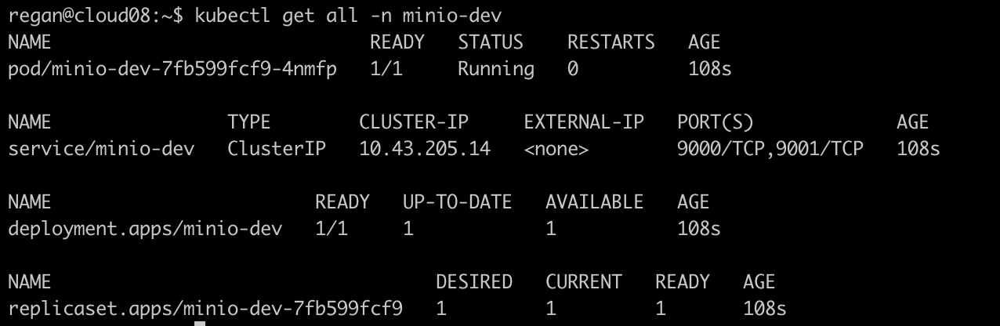
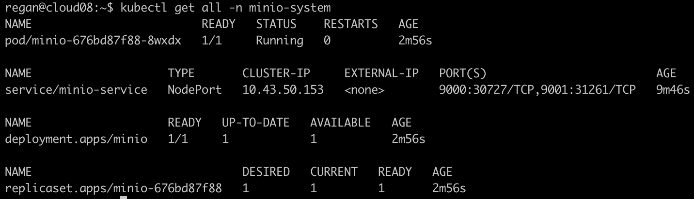
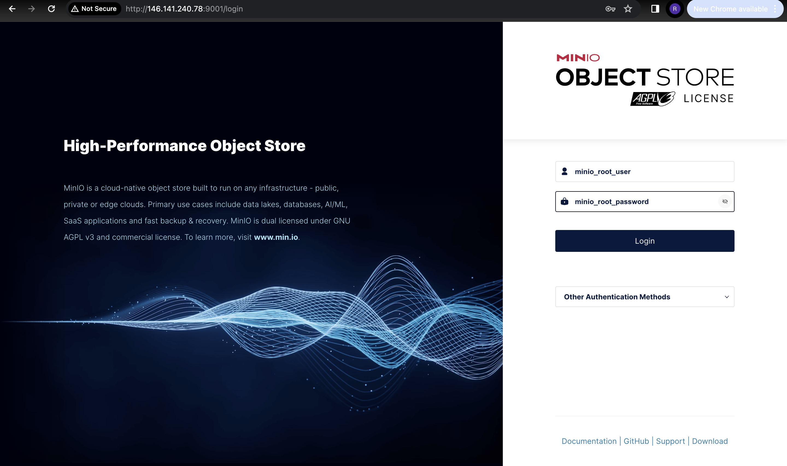
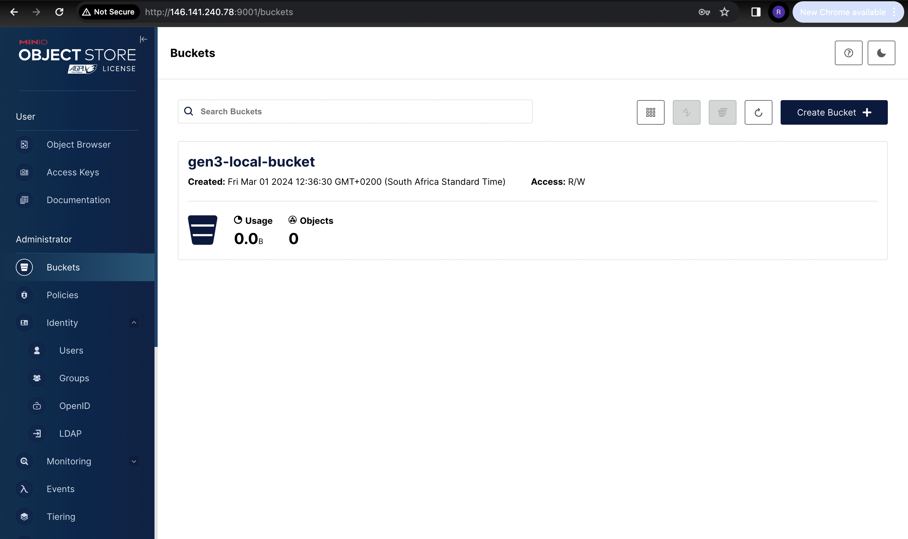
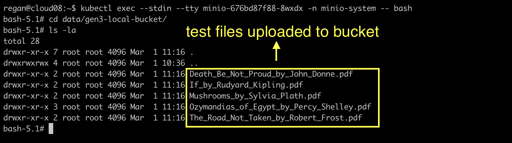

## MinIO on Kubernetes Cluster
Suppose we wish to upload to a bucket that is configured locally (on the node itself), and uses the Amazon S3 protocol. There exists several open-source options, but we'll describe the setup of [MinIO](https://min.io/docs/minio/kubernetes/upstream/index.html).   
To get the `minio-operator`, use the following command (adjust this command according to the version of choice):
```bash
https://github.com/minio/operator/releases/download/v5.0.12/kubectl-minio_5.0.12_linux_amd64
```
However, the `minio-operator` doesn't support the single-node-single-drive architecture, so we will not be using it. An An alternative is to use a Helm chart to install `minio`:
```bash
helm install minio-dev oci://registry-1.docker.io/bitnamicharts/minio \
--namespace minio-dev --create-namespace
```
The templates for this chart can be found inside the repository in the `/minio/minio-dev/` directory. The templates can be retrieved by running:
```bash
helm install minio-dev oci://registry-1.docker.io/bitnamicharts/minio \
helm install minio-dev oci://registry-1.docker.io/bitnamicharts/minio \
--namespace minio-dev --create-namespace \
--dry-run --debug
```
If the Helm installation is a success, the workloads in the `minio-dev` namespace can be seen with:
```bash
kubectl get all -n minio-dev
```
 

However, we will go with a simpler setup. There are five new resources that we'll create. The five resources to be created are:
- minio-system namespace  
- [minio-pvc](minio/minio-pvc.yaml)
- [minio-deployment](minio/minio-deployment.yaml)
- [minio-service](minio/minio-service.yaml)   
- [minio-ingress](minio/minio-ingress.yaml)   

```bash
kubectl create namespace minio-system
kubectl create -f minio/minio-pvc.yaml
kubectl create -f minio/minio-deployment.yaml
kubectl create -f minio/minio-service.yaml
kubectl create -f minio/minio-pv.yaml
kubectl create -f minio/minio-ingress.yaml
```
The `minio-ingress` references the secret `cloud08-tls-secret`, however, this secret exists in the `default` namespace. A replica of this secret should be created inside the `minio-system` namespace as well. After a few minutes, the pods inside the `minio-system` namespace should all be running and ready.    

   

The `minio-service` should be accessible on the following url: `http://<ip-address>:<nodePort>/minio`.    

   

Once logged in, a bucket, `gen3-local-bucket`, can be created using the UI.   

   

We can use the console (or UI) to upload test files to the `gen3-local-bucket`. These files should then be stored inside the `/data/gen3-local-bucket/` directory of the `minio` pod. To get inside the pod's container, run:
```bash
kubectl exec --stdin --tty minio-676bd87f88-8wxdx -n minio-system -- bash
```   

   
The files will be stored in the directory `/var/lib/rancher/k3s/storage`.  