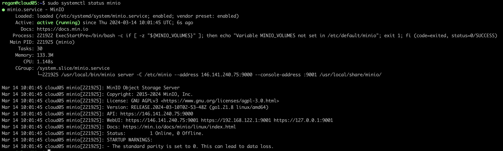
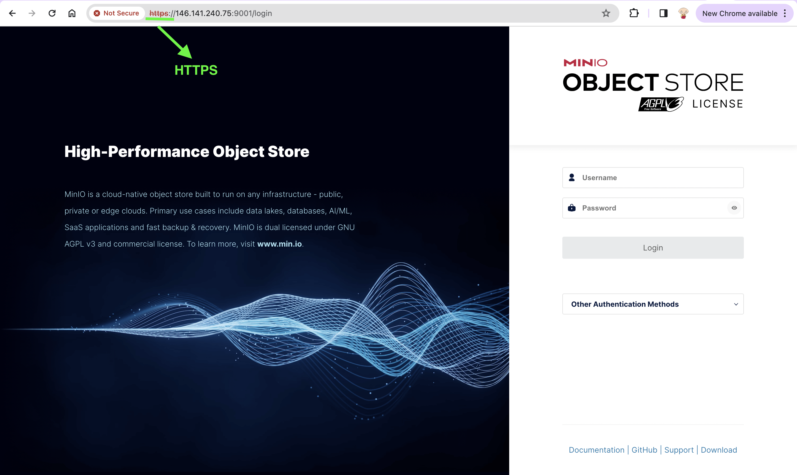

## MinIO on Single Node (Linux)
We'll be installing a single-node-single-drive (SNSD) instance of [Minio](https://min.io/docs/minio/linux/index.html) on a bare-metal Ubuntu machine (hostname `cloud05`). To install on an Ubuntu machine, run the following:
```bash
wget https://dl.min.io/server/minio/release/linux-amd64/minio
```
After the download is complete, we make the downloaded file executable with:
```bash
sudo chmod +x ./minio
```
Now we can move the executable file to the `/usr/local/bin` directory:
```bash
sudo mv ./minio /usr/local/bin
``` 
Instead of using `root` to work with MinIO, it is better to create a system group and user:
```bash
sudo useradd -r minio-user -s /sbin/nologin
```
We need to give this user permissions to the `minio` executable file:
```bash
sudo chown minio-user:minio-user /usr/local/bin/minio
```
A data directory needs to be created for where all the objects will be stored:
```bash
sudo mkdir /usr/local/share/minio
```
The ownership of this data directory needs to be given to the user and group:
```bash
sudo chown minio-user:minio-user /usr/local/share/minio
```
Environment variables need to be added for MinIO. We'll create another directory for this:
```bash
sudo mkdir /etc/minio
sudo chown minio-user:minio-user /etc/minio
```
Use `nano` or `vim` to open your preferred text editor and populate it with the following environment variables:
```bash
sudo vim /etc/default/minio
```
```txt
MINIO_VOLUMES="/mnt/data"

MINIO_OPTS="--certs-dir /home/regan/.minio/certs --console-address :9001"

MINIO_ROOT_USER=minioadmin

MINIO_ROOT_PASSWORD=minioadmin

MINIO_ACCESS_KEY="some_access_key"
MINIO_SECRET_KEY="some_secret_key"

MINIO_VOLUMES="/usr/local/share/minio/"
MINIO_OPTS="-C /etc/minio --address 146.141.240.75:9000 --console-address 146.141.240.75:9001"
```
We need to ensure that the firewall allows for ports 9000 and 9001 to be open. Since we are using `iptables`, we use:
```bash
sudo iptables -I INPUT -p tcp -s 0.0.0.0/0 --dport 9000 -j ACCEPT
sudo iptables -I INPUT -p tcp -s 0.0.0.0/0 --dport 9001 -j ACCEPT
```
For MinIO to be started whenever the system boots up, we need to install the following script:
```bash
curl -O https://raw.githubusercontent.com/minio/minio-service/master/linux-systemd/minio.service
```
This downloaded script needs to be moved to the `systemd` directory:
```bash
sudo mv minio.service /etc/systemd/system
```
Now we need to create a self-signed certificate for our MinIO server. First, we download the binary file from `certgen`:
```bash
wget https://github.com/minio/certgen/releases/download/v1.2.1/certgen_1.2.1_linux_amd64.deb
```
After the download is complete, install the package with:
```bash
sudo dpkg -i certgen_1.2.1_linux_amd64.deb
```
If the installation has been successful, then running `certgen -h` will output a list of commands.   

To generate a certificate for the host machine, run:
```bash
sudo certgen -host cloud05.core.wits.ac.za, 146.141.240.75	
```
A new certificate, `public.crt` and `private.key`, should have been created. These files need to be moved to the `/etc/minio/` directory:
```bash
sudo mv private.key public.crt /etc/minio/
```
Ownership of both files need to be given to the MinIO user and group:
```bash
sudo chown minio-user:minio-user /etc/minio/private.key
sudo chown minio-user:minio-user /etc/minio/public.crt
```
To apply the changes, we need to reload the `systemd` service files:
```bash
sudo systemctl daemon-reload
sudo systemctl enable minio
```
We can now start MinIO with:
```bash
sudo systemctl start minio
```
We can check the status with:
```bash
sudo systemctl status minio
```
    

We should also see that MinIO can be accessed on HTTPS. This is good news, since it means that the generation of SSL certificates was a success.   

 

Once logged in, we can create a bucket called `gen3-minio-bucket` that will be used for all the Gen3 file uploads.   

 

