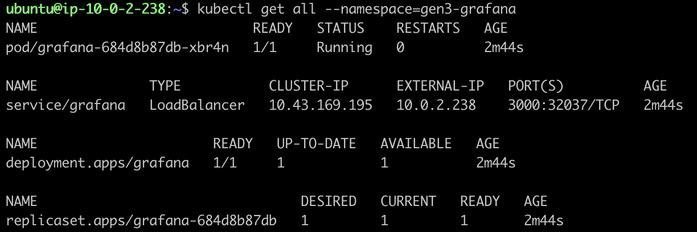

## Grafana OSS in Kubernetes (Optional)   
Grafana open source software (OSS) allows for the querying, visualising, alerting on, and exploring of metrics, logs, and traces wherever they are stored. Graphs and visualisations can be created from time-series database (TSDB) data with the tools that are provided by Grafana OSS. We'll be using the [Grafana documentation](https://grafana.com/docs/grafana/latest/setup-grafana/installation/kubernetes/) to guide us in installing Grafana in our k8s cluster.   

To create a namespace for Grafana, run the following command:
```bash
kubectl create namespace gen3-grafana
```
We'll create a `grafana.yaml` file which will contain the blueprint for a persistent volume claim (pvc), a service of type loadbalancer, and a deployment. This file can be found in the `grafana` directory of this repo. To create these resources, we need to apply the manifest as follows:
```bash
kubectl apply -f grafana/grafana.yaml --namespace=gen3-grafana
```
To get all information about the Grafana deplyment, run:
```bash
kubectl get all --namespace=gen3-grafana
```
  

The `grafana` service should have an **EXTERNAL-IP**. This IP can be used to access the Grafana sign-in page in the browser. If there is no **EXTERNAL_IP**, then port-forwarding can be performed like this:
```bash
kubectl port-forward service/grafana 3000:3000 --namespace=gen3-grafana
```
Then the Grafana sign-in page can be accessed on `http://<ip-address>:3000`. Use `admin` for both the username and the password.   
  