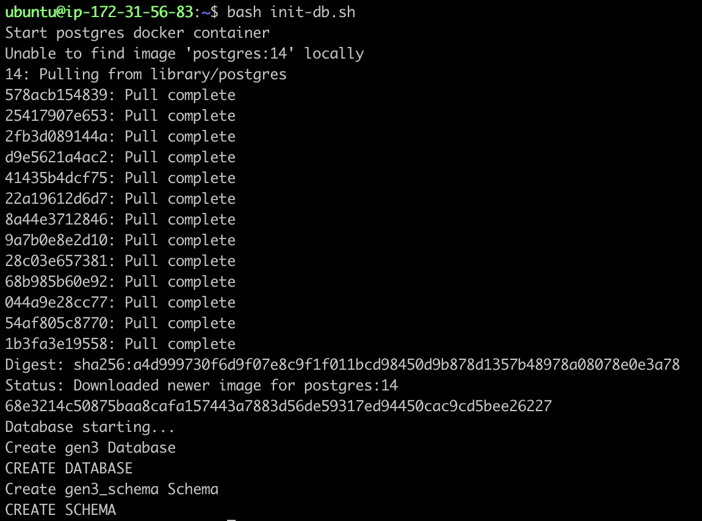

## Running a PostgreSQL Database inside a Docker Container (Optional)
A postgreSQL database can be created to run inside a Docker container. This should not be in the Kubernetes cluster. This is not necessary for testing, but would be required if a persistent database is required. The following commands can be copied into a script called `init-db.sh` for convenience, or they could be run independently, but sequentially, as follows:
```bash
echo "Start postgres docker container"
docker run --rm --name gen3-dev-db -e POSTGRES_PASSWORD=gen3-password -d -p 5432:5432 -v postgres_gen3_dev:/var/lib/postgresql/data postgres:14
echo "Database starting..."
sleep 10
echo "Create gen3 Database"
docker exec -it gen3-dev-db bash -c 'PGPASSWORD=gen3-password psql -U postgres -c "create database gen3_db"'
echo "Create gen3_schema Schema"
docker exec -it gen3-dev-db bash -c 'PGPASSWORD=gen3-password psql -U postgres -d gen3_db -c "create schema gen3_schema"'
```
If the script runs successfully, the output should look like:
   
By default, the hostname of the database is the container id.   