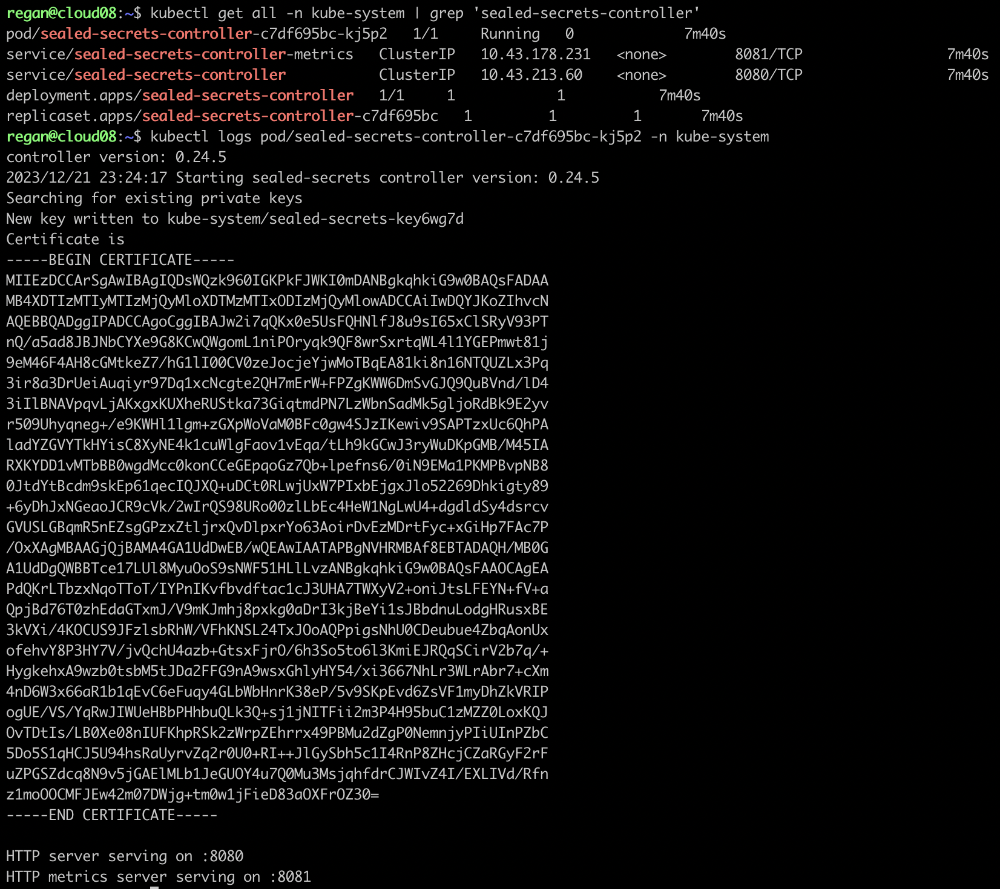

## Sealed Secrets
### Introduction and Installation
Sensitive data like passwords and tokens are stored inside Kubernetes **secrets**. When a Kubernetes secret is created, it encodes the sensitive data using base64 encoding. Such a secret cannot securely be stored in a Git repository because it is fairly easy to decode a string that has been base64 encoded.   

For example, suppose we have a database password that is _mySuperSecretDBPassword_. An opaque secret can be created imperatively with the command:
```bash
kubectl create secret generic my-db-secret --from-literal=password=mySuperSecretDBPassword
```
The Kubernetes secret would look something like this:
```yaml
apiVersion: v1
kind: Secret
metadata:
  name: my-db-secret
type: Opaque
data:
  password: bXlTdXBlclNlY3JldERCUGFzc3dvcmQK
```
The password can easily be retrieved by running the following command in a Linux or Mac terminal:
```bash
echo 'bXlTdXBlclNlY3JldERCUGFzc3dvcmQK' | base64 --decode
```
This creates a challenge for developers and administrators in that it is not safe to store Kubernetes secrets in a Git repository. This is where **Sealed Secrets** become useful. Sealed secrets are a Custom Resource Definition (CRD) that has kind **SealedSecret**. They get managed by a cluster-side operator. `kubeseal` is a client-side utility that uses asymmetric cryptography to encrypt secrets that can only be decrypted by the controller itself.   

`kubeseal` can be installed in Linux as follows:
```bash
KUBESEAL_VERSION='0.24.5'
wget "https://github.com/bitnami-labs/sealed-secrets/releases/download/v${KUBESEAL_VERSION:?}/kubeseal-${KUBESEAL_VERSION:?}-linux-amd64.tar.gz"
tar -xvzf kubeseal-${KUBESEAL_VERSION:?}-linux-amd64.tar.gz kubeseal
sudo install -m 755 kubeseal /usr/local/bin/kubeseal
```

The controller can be installed by applying the manifest in the cluster:
```bash
kubectl apply -f https://github.com/bitnami-labs/sealed-secrets/releases/download/v0.24.5/controller.yaml
```
These are the contents of the manifest for the controller (v0.24.5):
```yaml
---
apiVersion: rbac.authorization.k8s.io/v1
kind: ClusterRoleBinding
metadata:
  annotations: {}
  labels:
    name: sealed-secrets-controller
  name: sealed-secrets-controller
roleRef:
  apiGroup: rbac.authorization.k8s.io
  kind: ClusterRole
  name: secrets-unsealer
subjects:
- kind: ServiceAccount
  name: sealed-secrets-controller
  namespace: kube-system
---
apiVersion: rbac.authorization.k8s.io/v1
kind: ClusterRole
metadata:
  annotations: {}
  labels:
    name: secrets-unsealer
  name: secrets-unsealer
rules:
- apiGroups:
  - bitnami.com
  resources:
  - sealedsecrets
  verbs:
  - get
  - list
  - watch
- apiGroups:
  - bitnami.com
  resources:
  - sealedsecrets/status
  verbs:
  - update
- apiGroups:
  - ""
  resources:
  - secrets
  verbs:
  - get
  - list
  - create
  - update
  - delete
  - watch
- apiGroups:
  - ""
  resources:
  - events
  verbs:
  - create
  - patch
- apiGroups:
  - ""
  resources:
  - namespaces
  verbs:
  - get
---
apiVersion: rbac.authorization.k8s.io/v1
kind: RoleBinding
metadata:
  annotations: {}
  labels:
    name: sealed-secrets-service-proxier
  name: sealed-secrets-service-proxier
  namespace: kube-system
roleRef:
  apiGroup: rbac.authorization.k8s.io
  kind: Role
  name: sealed-secrets-service-proxier
subjects:
- apiGroup: rbac.authorization.k8s.io
  kind: Group
  name: system:authenticated
---
apiVersion: rbac.authorization.k8s.io/v1
kind: Role
metadata:
  annotations: {}
  labels:
    name: sealed-secrets-service-proxier
  name: sealed-secrets-service-proxier
  namespace: kube-system
rules:
- apiGroups:
  - ""
  resourceNames:
  - sealed-secrets-controller
  resources:
  - services
  verbs:
  - get
- apiGroups:
  - ""
  resourceNames:
  - 'http:sealed-secrets-controller:'
  - http:sealed-secrets-controller:http
  - sealed-secrets-controller
  resources:
  - services/proxy
  verbs:
  - create
  - get
---
apiVersion: rbac.authorization.k8s.io/v1
kind: RoleBinding
metadata:
  annotations: {}
  labels:
    name: sealed-secrets-controller
  name: sealed-secrets-controller
  namespace: kube-system
roleRef:
  apiGroup: rbac.authorization.k8s.io
  kind: Role
  name: sealed-secrets-key-admin
subjects:
- kind: ServiceAccount
  name: sealed-secrets-controller
  namespace: kube-system
---
apiVersion: rbac.authorization.k8s.io/v1
kind: Role
metadata:
  annotations: {}
  labels:
    name: sealed-secrets-key-admin
  name: sealed-secrets-key-admin
  namespace: kube-system
rules:
- apiGroups:
  - ""
  resources:
  - secrets
  verbs:
  - create
  - list
---
apiVersion: v1
kind: Service
metadata:
  annotations: {}
  labels:
    name: sealed-secrets-controller-metrics
  name: sealed-secrets-controller-metrics
  namespace: kube-system
spec:
  ports:
  - port: 8081
    targetPort: 8081
  selector:
    name: sealed-secrets-controller
  type: ClusterIP
---
apiVersion: v1
kind: ServiceAccount
metadata:
  annotations: {}
  labels:
    name: sealed-secrets-controller
  name: sealed-secrets-controller
  namespace: kube-system
---
apiVersion: apps/v1
kind: Deployment
metadata:
  annotations: {}
  labels:
    name: sealed-secrets-controller
  name: sealed-secrets-controller
  namespace: kube-system
spec:
  minReadySeconds: 30
  replicas: 1
  revisionHistoryLimit: 10
  selector:
    matchLabels:
      name: sealed-secrets-controller
  strategy:
    rollingUpdate:
      maxSurge: 25%
      maxUnavailable: 25%
    type: RollingUpdate
  template:
    metadata:
      annotations: {}
      labels:
        name: sealed-secrets-controller
    spec:
      containers:
      - args: []
        command:
        - controller
        env: []
        image: docker.io/bitnami/sealed-secrets-controller:v0.24.5
        imagePullPolicy: IfNotPresent
        livenessProbe:
          httpGet:
            path: /healthz
            port: http
        name: sealed-secrets-controller
        ports:
        - containerPort: 8080
          name: http
        - containerPort: 8081
          name: metrics
        readinessProbe:
          httpGet:
            path: /healthz
            port: http
        securityContext:
          allowPrivilegeEscalation: false
          capabilities:
            drop:
            - ALL
          readOnlyRootFilesystem: true
        stdin: false
        tty: false
        volumeMounts:
        - mountPath: /tmp
          name: tmp
      imagePullSecrets: []
      initContainers: []
      securityContext:
        fsGroup: 65534
        runAsNonRoot: true
        runAsUser: 1001
        seccompProfile:
          type: RuntimeDefault
      serviceAccountName: sealed-secrets-controller
      terminationGracePeriodSeconds: 30
      volumes:
      - emptyDir: {}
        name: tmp
---
apiVersion: apiextensions.k8s.io/v1
kind: CustomResourceDefinition
metadata:
  name: sealedsecrets.bitnami.com
spec:
  group: bitnami.com
  names:
    kind: SealedSecret
    listKind: SealedSecretList
    plural: sealedsecrets
    singular: sealedsecret
  scope: Namespaced
  versions:
  - name: v1alpha1
    schema:
      openAPIV3Schema:
        description: SealedSecret is the K8s representation of a "sealed Secret" -
          a regular k8s Secret that has been sealed (encrypted) using the controller's
          key.
        properties:
          apiVersion:
            description: 'APIVersion defines the versioned schema of this representation
              of an object. Servers should convert recognized schemas to the latest
              internal value, and may reject unrecognized values. More info: https://git.k8s.io/community/contributors/devel/sig-architecture/api-conventions.md#resources'
            type: string
          kind:
            description: 'Kind is a string value representing the REST resource this
              object represents. Servers may infer this from the endpoint the client
              submits requests to. Cannot be updated. In CamelCase. More info: https://git.k8s.io/community/contributors/devel/sig-architecture/api-conventions.md#types-kinds'
            type: string
          metadata:
            type: object
          spec:
            description: SealedSecretSpec is the specification of a SealedSecret
            properties:
              data:
                description: Data is deprecated and will be removed eventually. Use
                  per-value EncryptedData instead.
                format: byte
                type: string
              encryptedData:
                additionalProperties:
                  type: string
                type: object
                x-kubernetes-preserve-unknown-fields: true
              template:
                description: Template defines the structure of the Secret that will
                  be created from this sealed secret.
                properties:
                  data:
                    additionalProperties:
                      type: string
                    description: Keys that should be templated using decrypted data
                    nullable: true
                    type: object
                  metadata:
                    description: 'Standard object''s metadata. More info: https://git.k8s.io/community/contributors/devel/api-conventions.md#metadata'
                    nullable: true
                    properties:
                      annotations:
                        additionalProperties:
                          type: string
                        type: object
                      finalizers:
                        items:
                          type: string
                        type: array
                      labels:
                        additionalProperties:
                          type: string
                        type: object
                      name:
                        type: string
                      namespace:
                        type: string
                    type: object
                    x-kubernetes-preserve-unknown-fields: true
                  type:
                    description: Used to facilitate programmatic handling of secret
                      data.
                    type: string
                type: object
            required:
            - encryptedData
            type: object
          status:
            description: SealedSecretStatus is the most recently observed status of
              the SealedSecret.
            properties:
              conditions:
                description: Represents the latest available observations of a sealed
                  secret's current state.
                items:
                  description: SealedSecretCondition describes the state of a sealed
                    secret at a certain point.
                  properties:
                    lastTransitionTime:
                      description: Last time the condition transitioned from one status
                        to another.
                      format: date-time
                      type: string
                    lastUpdateTime:
                      description: The last time this condition was updated.
                      format: date-time
                      type: string
                    message:
                      description: A human readable message indicating details about
                        the transition.
                      type: string
                    reason:
                      description: The reason for the condition's last transition.
                      type: string
                    status:
                      description: 'Status of the condition for a sealed secret. Valid
                        values for "Synced": "True", "False", or "Unknown".'
                      type: string
                    type:
                      description: 'Type of condition for a sealed secret. Valid value:
                        "Synced"'
                      type: string
                  required:
                  - status
                  - type
                  type: object
                type: array
              observedGeneration:
                description: ObservedGeneration reflects the generation most recently
                  observed by the sealed-secrets controller.
                format: int64
                type: integer
            type: object
        required:
        - spec
        type: object
    served: true
    storage: true
    subresources:
      status: {}
---
apiVersion: v1
kind: Service
metadata:
  annotations: {}
  labels:
    name: sealed-secrets-controller
  name: sealed-secrets-controller
  namespace: kube-system
spec:
  ports:
  - port: 8080
    targetPort: 8080
  selector:
    name: sealed-secrets-controller
  type: ClusterIP

```
After creating the resources from the manifest file, there should be a pod with the name `sealed-secrets-controller-` followed by some unique combination of characters. This pod exists in the `kube-system` namespace and can be easily found by running:
```bash
kubectl get all -n kube-system | grep 'sealed-secrets-controller'
```
The public certificate data can be obtained by reading the logs of the pod, e.g.
```bash
kubectl logs pod/sealed-secrets-controller-c7df695bc-kj5p2 -n kube-system
```
This certificate data can be copied and saved into a file called `public-cert.pem`. Alternatively, the `kubeseal` command-line tool can be used to generate the certificate file as follows:
```bash
kubeseal --fetch-cert > public-cert.pem
```
   
