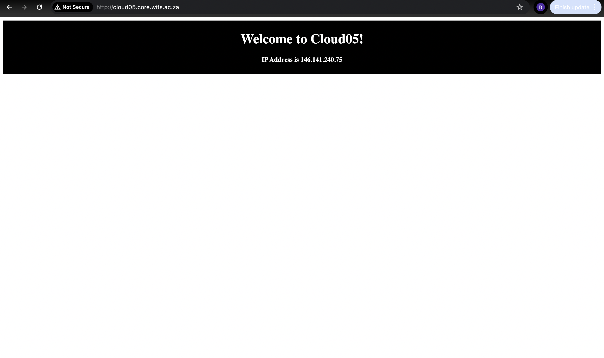

## NGINX
NGINX is a web server than can be used as a reverse proxy. We would like to use it to serve MinIO on a url so that we don't need to specify the port on which it runs, for example, `https://ip-address:port`. The `fence` service in Gen3 cannot parse a url that has the port explicitly included.   

### Installation and Setup of NGINX
We can install NGINX using the `apt` package manager with the following commands:
```bash
sudo apt update
sudo apt install nginx
```
To check if the installation is successful, we can run:
```bash
systemctl status nginx
```
There exist several other commands for engaging with the NGINX process, e.g.
```bash
systemctl enable nginx
systemctl start nginx
systemctl stop nginx
systemctl restart nginx
systemctl reload nginx
systemctl disable nginx
```
On Ubuntu 22, NGINX has one server block enabled by default. Its configuration for serving documents can be found inside the directory `/var/www/html`. When serving multiple websites or web addresses, it's more convenient to create a separate directory for our domain name, i.e.
```bash
sudo mkdir -p /var/www/domain_name/html
```
Assign ownership to the `$USER` with 
```bash
sudo chown -R $USER:$USER /var/www/domain_name/html
```
To ensure that the owner can read, write, and execute files while other users and groups can _only_ read and execute, we run
```bash
sudo chmod -R 755 /var/www/domain_name
```
We then create an `index.html` file and use our text editor to populate it with the following HTML structure inside `/var/www/domain_name/html/index.html`:
```html
<html lang="en">
<head>
    <title>Welcome to Cloud05</title>
    <meta charset="utf-8">
    <meta name="viewport" content="width=device-width, initial-scale=1">
    <style>
        .title-page-header {
            background-color: #000;
            padding: 4px;
        }

        .header-text {
            color: #FFF;
            text-align: center;
        }
    </style>
</head>

<body>
    <div class="title-page-header">
        <header class="header-text">
            <h1><b>Welcome to Cloud05!</b></h1>
            <h4>IP Address is 146.141.240.75</h4>
        </header>
    </div>
</body>
</html>
```
In order to have this file served by NGINX, and without modifying the `/var/www/domain_name/index.html` file directly, it's necessary to create a server block with the correct directives:
```bash
sudo vim /etc/nginx/sites-available/domain_name
```
This configuration file should be populated with the following:
```
server {
        listen 80;
        listen [::]:80;

        root /var/www/domain_name/html;
        index index.html index.htm index.nginx-debian.html;

        server_name domain_name www.domain_name ip-address;

        location / {
                try_files $uri $uri/ =404;
        }
}
```
Now we enable the file by creating a link from the `sites-enabled` directory:
```bash
sudo ln -s /etc/nginx/sites-available/cloud05.core.wits.ac.za /etc/nginx/sites-enabled/
```
After doing this, we should see the `index.html` page being rendered when visiting `http://domain_name` or `http://ip-address`:   


We've enabled two server blocks which have been configured to respond to requests based on their `listen` and `server_name` directives:
- domain_name: responds to requests for `domain_name` and `www.domain_name`   
- default: responds to any requests on port 80 that do not match the other two blocks   

To avoid getting a hash bucket memory problem which can arise when additional server names are added, we need to modify the `/etc/nginx/nginx.conf` file by uncommenting the line:
```
...
http {
    ...
    server_names_hash_bucket_size 64;
    ...
}
...
```
We should also make sure to add the line
```
include /etc/nginx/sites-enabled/*;
```
to the `nginx.conf` file. To ensure that there are no syntax errors in the `/etc/nginx/nginx.conf` file, we can run
```bash
sudo nginx -t
```
If no problems exist, then NGINX can be restarted with
```bash
sudo systemctl restart nginx
```

### Configuring MinIO
We'd like to setup the NGINX reverse proxy to redirect traffic to the MinIO API. The Gen3 microservice, `fence`, needs to upload data to an S3 bucket. MinIO is a suitable on-prem candidate for achieving this, however, there is a bug in `fence` that causes a failed response when trying to upload to a url that explicitly contains a non standard port (port 9000 in the case of MinIO). To get around this bug, we use the domain name of the node on which MinIO is installed (http://cloud05.core.wits.ac.za) to redirect requests to https://cloud05.core.wits.ac.za:9000. The configuration for this redirect can be found below (this is to be placed inside `/etc/nginx/sites-available/cloud05.core.wits.ac.za`):   
```conf
upstream minio_s3 {
   least_conn;
   server cloud05.core.wits.ac.za:9000;
}
upstream minio_console {
   least_conn;
   server cloud05.core.wits.ac.za:9001;
}
server {
   listen       80;
   listen  [::]:80;
   listen       443 ssl;
   listen  [::]:443 ssl;
   server_name  cloud05.core.wits.ac.za 146.141.240.75;

   # certificate stuff
   ssl_certificate "/etc/minio/public.crt";
   ssl_certificate_key "/etc/minio/private.key";
   ssl_prefer_server_ciphers on;
   # Allow special characters in headers
   ignore_invalid_headers off;
   # Allow any size file to be uploaded.
   # Set to a value such as 1000m; to restrict file size to a specific value
   client_max_body_size 0;
   # Disable buffering
   proxy_buffering off;
   proxy_request_buffering off;
   location / {
      proxy_set_header Host $http_host;
      proxy_set_header X-Real-IP $remote_addr;
      proxy_set_header X-Forwarded-For $proxy_add_x_forwarded_for;
      proxy_set_header X-Forwarded-Proto $scheme;
      proxy_connect_timeout 300;
      # Default is HTTP/1, keepalive is only enabled in HTTP/1.1
      proxy_http_version 1.1;
      proxy_set_header Connection "";
      chunked_transfer_encoding off;
      proxy_pass https://minio_s3; # This uses the upstream directive definition to load balance
   }
   location /minio/ui/ {
      rewrite ^/minio/ui/(.*) /$1 break;
      proxy_set_header Host $http_host;
      proxy_set_header X-Real-IP $remote_addr;
      proxy_set_header X-Forwarded-For $proxy_add_x_forwarded_for;
      proxy_set_header X-Forwarded-Proto $scheme;
      proxy_set_header X-NginX-Proxy true;
      # This is necessary to pass the correct IP to be hashed
      real_ip_header X-Real-IP;
      proxy_connect_timeout 300;
      # To support websockets in MinIO versions released after January 2023
      proxy_http_version 1.1;
      proxy_set_header Upgrade $http_upgrade;
      proxy_set_header Connection "upgrade";
      # Some environments may encounter CORS errors (Kubernetes + Nginx Ingress)
      # Uncomment the following line to set the Origin request to an empty string
      # proxy_set_header Origin '';
      chunked_transfer_encoding off;
      proxy_pass https://minio_console; # This uses the upstream directive definition to load balance
   }
}
```