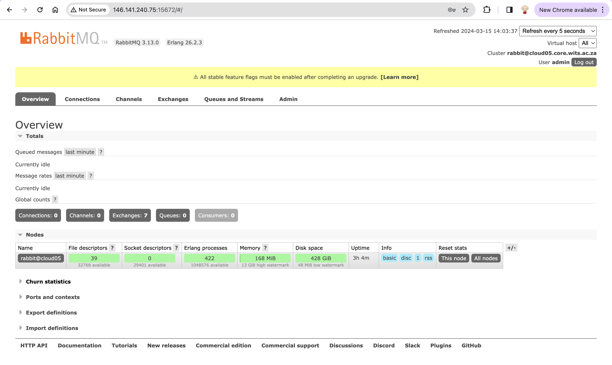

## RabbitMQ
To setup **RabbitMQ** on `cloud05`, use the [rabbitmq_installation.sh script](../rabbitmq/rabbitmq_installation.sh) found inside this repository (it comes directly from the [rabbitmq documentation website](https://www.rabbitmq.com/docs/install-debian#apt-quick-start-cloudsmith)):
```bash
sudo bash rabbitmq_installation.sh
```   

If the script runs successfully to completion, the status of `rabbitmq` can be checked with:
```bash
systemctl status rabbitmq-server.service
```
and the ouput should contain _active_.    

   

To see if `rabbitmq` is enabled, simply run:
```bash
systemctl is-enabled rabbitmq-server.service
```
and the output should be `enabled`. If it is _not_ enabled, it can be enabled with:
```bash
sudo systemctl enable rabbitmq-server
```
For ease of use and convenience, the UI management dashboard can be enabled with
```bash
sudo rabbitmq-plugins enable rabbitmq_management
```
The UI management dashboard should be accessible on port `15672`, so the web address would be `http://<server-ip>:15672`.   

 

Create an admin user and set a good password for the admin user:
```bash
sudo rabbitmqctl add_user admin <some_password>
```
Set tags for the admin user:
```bash
sudo rabbitmqctl set_user_tags admin administrator
```
It is now possible to login with user `admin` and the password that was set above:   

 
